# 🎟️ Plataforma de Rifas Online

Bienvenido a la plataforma de rifas en línea. Esta aplicación permite a los usuarios participar en rifas seleccionando números y subiendo comprobantes de pago, mientras que los administradores pueden gestionar rifas, validar reservas y controlar todo desde un panel exclusivo.


---

## 🚀 Vista Previa capture

### 🧑 Cliente

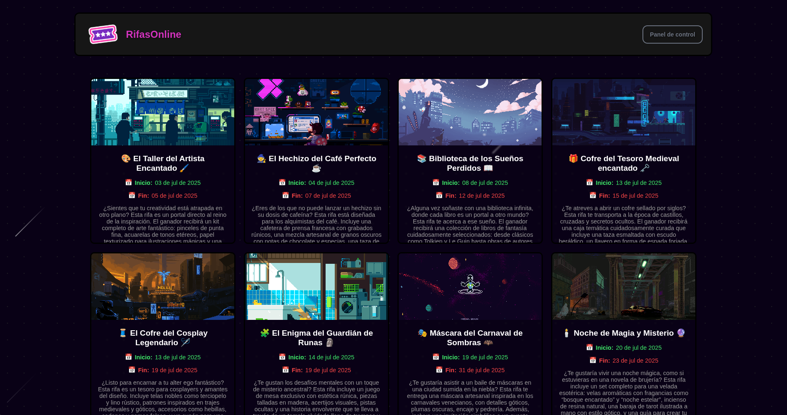

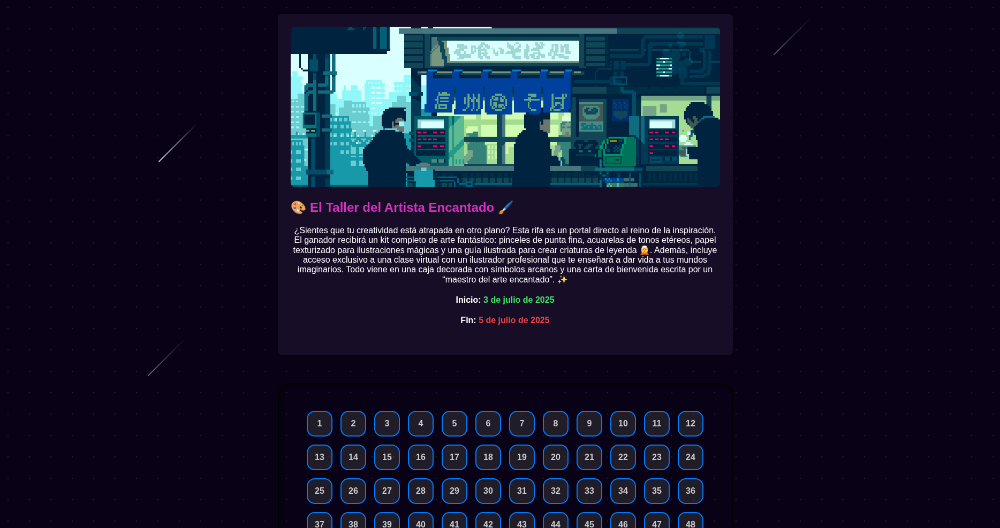

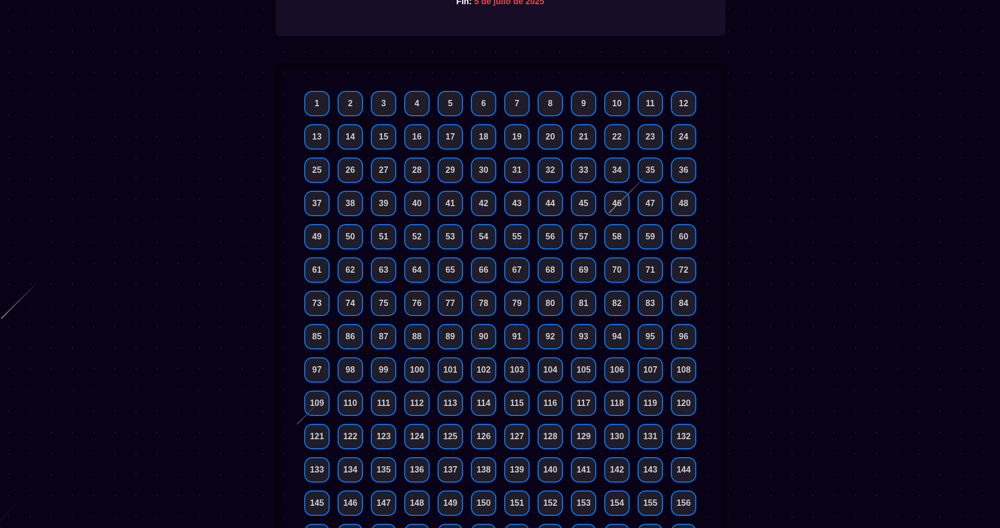

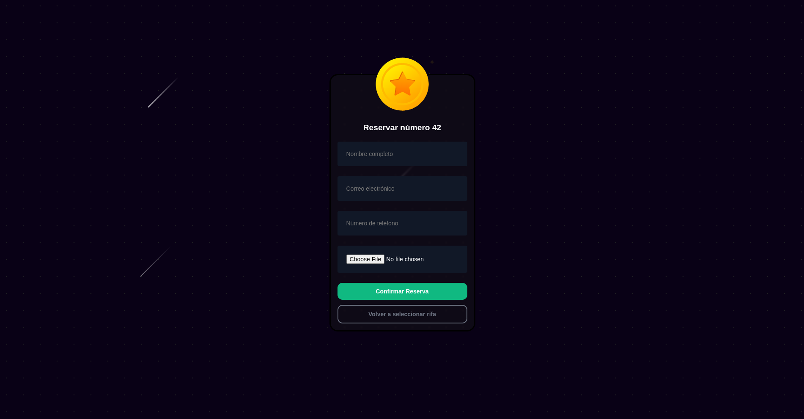

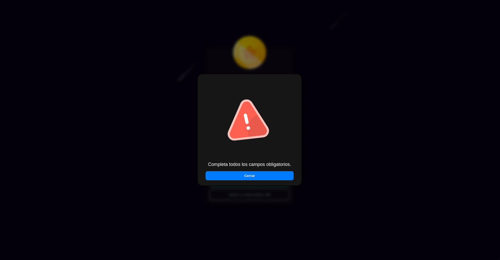

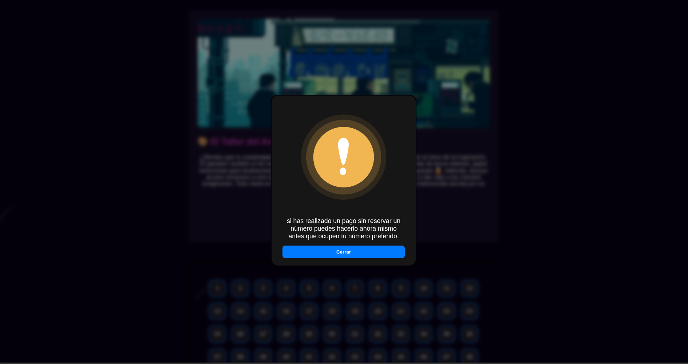


### 👨‍💻 Panel de Administración


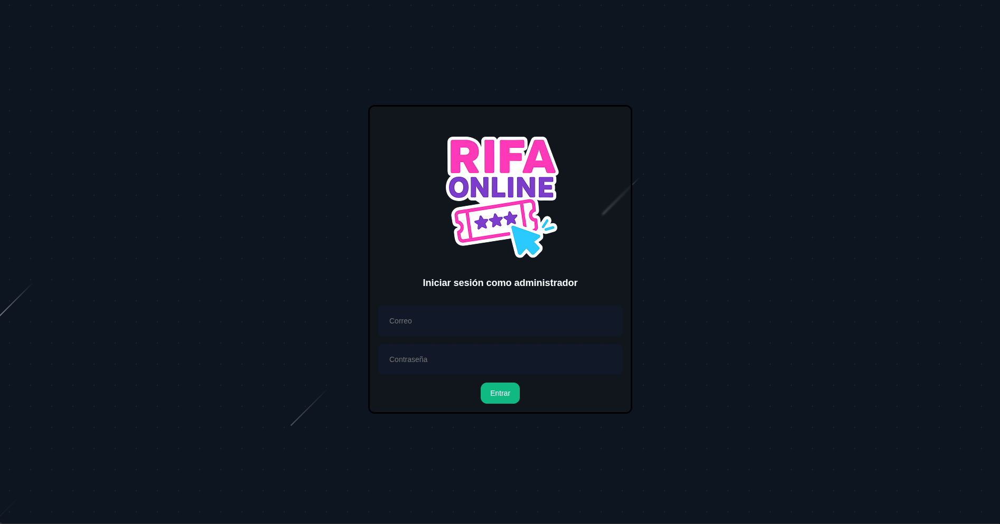

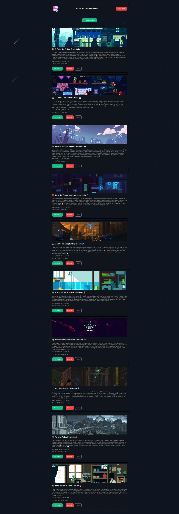

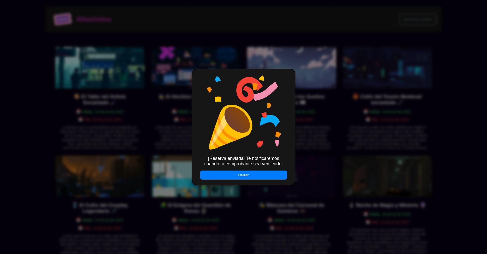

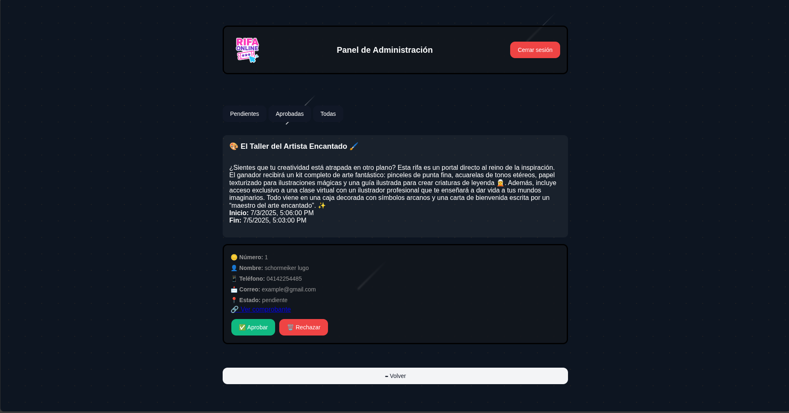

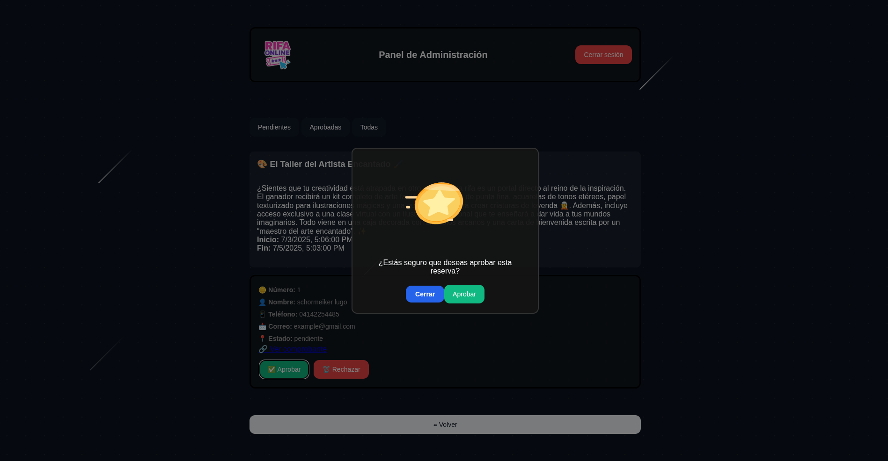

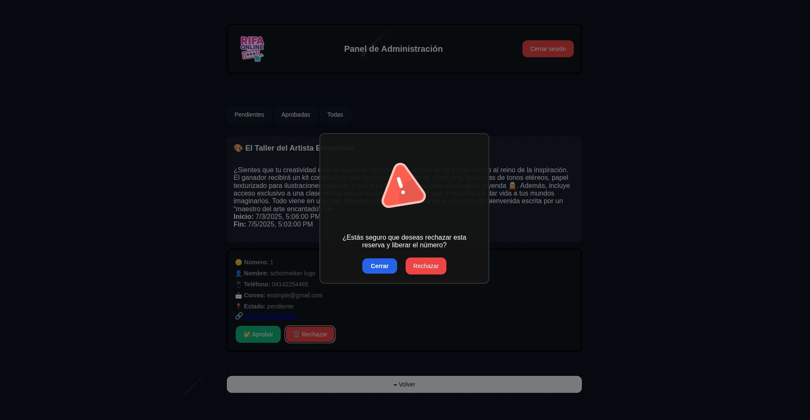

---

## ✨ Características

- 🎯 Rifa en vivo: Los usuarios pueden comprar tickets y ver el contador de tickets disponibles al instante
- 🧑‍💼 Panel de administrador para gestionar rifas, validar reservas y editar información.
- 💾 Conexión directa a Supabase (auth, storage y base de datos, edge functions).
- 💡 Estructura modular por funcionalidades (UI, reservas, rifas, etc).
- ⚡ Animaciones con CSS.
- 📱 Responsive: UI totalmente adaptada a escritorio y móvil.
- 📁 Proyecto 100% frontend utilizando supabase para el backend.

---

## 🛠️ Tecnologías Utilizadas

| Frontend       | Backend / BDD   | Utilidades       |
|----------------|------------------|------------------|
| HTML, CSS, JS  | Supabase (PostgreSQL + Auth + Storage) | Modales personalizados |
| Animaciones CSS | | Validación visual con clases CSS |

---

## 📁 Estructura del Proyecto

```plaintext
.
├── README.md
├── admin.html
├── index.html
├── api/
│   ├── supabaseAdmin.js
│   └── supabaseFunctions.js
├── assets/
│   └── capture/
│       ├── admin/
│       └── cliente/
├── styles/
│   ├── admin/
│   │   ├── admin-styles.css
│   │   ├── base.css
│   │   ├── boton-arriba.css
│   │   ├── botones-base.css
│   │   ├── filtros-reservas.css
│   │   ├── fondo.css
│   │   ├── formulario.css
│   │   ├── header.css
│   │   ├── imagenes-extras.css
│   │   ├── info-rifa.css
│   │   ├── login.css
│   │   ├── main.css
│   │   ├── modal.css
│   │   ├── reservas.css
│   │   ├── tarjetas.css
│   │   ├── utilidades.css
│   │   └── variables.css
│   └── cliente/
│       ├── base.css
│       ├── boton-arriba.css
│       ├── fondo.css
│       ├── formulario.css
│       ├── header.css
│       ├── info-rifa.css
│       ├── loader-reservas.css
│       ├── main.css
│       ├── modal-imagen.css
│       ├── modal.css
│       ├── numeros.css
│       ├── preloader.css
│       ├── progreso.css
│       ├── tarjetas.css
│       ├── utilidades.css
│       ├── variables.css
│       └── styles.css
├── src/
│   ├── admin/
│   │   ├── admin.js
│   │   ├── funciones/
│   │   │   ├── editarRifa.js
│   │   │   ├── formRifasAdmin.js
│   │   │   ├── helpersAdmin.js
│   │   │   ├── reservasAdmin.js
│   │   │   └── rifasAdmin.js
│   │   ├── login/
│   │   │   └── loginAdmin.js
│   │   └── ui/
│   │       ├── modal/
│   │       │   └── modalAdmin.js
│   │       ├── scrollControlAdmin.js
│   │       ├── uiAdminHelpers.js
│   │       └── utilsAdmin.js
│   └── cliente/
│       ├── app.js
│       ├── funciones/
│       │   ├── cargarRifas.js
│       │   └── reservas.js
│       └── ui/
│           ├── infoRifaUI.js
│           ├── modal/
│           │   └── modal.js
│           ├── numerosUI.js
│           ├── preloader/
│           │   └── preloader.js
│           ├── scrollControl.js
│           └── uiHelpers.js
└── supabase/
    ├── config.toml
    └── functions/
        ├── admin-create-rifa/
        │   ├── .npmrc
        │   ├── deno.json
        │   └── index.ts
        ├── admin-delete-rifa/
        │   ├── .npmrc
        │   ├── deno.json
        │   └── index.ts
        ├── admin-moderate-reserva/
        │   ├── .npmrc
        │   ├── deno.json
        │   └── index.ts
        ├── admin-update-rifa/
        │   ├── .npmrc
        │   ├── deno.json
        │   └── index.ts
        └── send-email/
            ├── .npmrc
            ├── deno.json
            └── index.ts
``` 
## 🔐 Acceso al Panel de Administración

Para entrar al panel de administración:

Accede a /admin.html

Inicia sesión con tus credenciales de Supabase Auth

Una vez validado:

Verás el encabezado del panel

Accederás a las rifas y reservas

Podrás editar, eliminar o aprobar reservas

## 🧪 Estado del Proyecto

✅ MVP funcional completo.

✅ Separación por microservicios con Edge Functions.

✅ Sistema de login para el admin con funcion a token para validad peticiones con mayor seguridad.

✅ integrar preloader para los procesos de subida multimedia.

🔜 En desarrollo:

 Empaquetado con Docker.

 Pagos automáticos (MercadoPago, Stripe, bitcoin, etc.)

 Historial de ganadores.

 Sistema de notificaciones.

🧠 ## Créditos y Agradecimientos

🧑‍💻 Desarrollado por: Schormeiker Lugo

❤️ Gracias a Supabase por ofrecer una suite backend tan completa.
